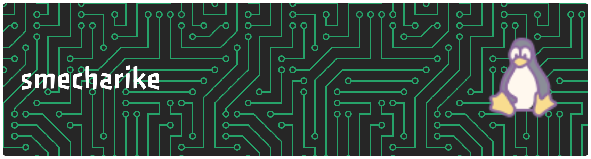

  

<!--
**smecharike/smecharike** is a ✨ _special_ ✨ repository because its `README.md` (this file) appears on your GitHub profile.

Here are some ideas to get you started:

- 🔭 I’m currently working on ...
- 🌱 I’m currently learning ...
- 👯 I’m looking to collaborate on ...
- 🤔 I’m looking for help with ...
- 💬 Ask me about ...
- 📫 How to reach me: ...
- 😄 Pronouns: ...
- ⚡ Fun fact: ...
-->

<!-- Links -->

## 🔥 Skills
<!-- Skills: Programming Languages -->
  

    <h3>Programming Languages</h3>
    
    
    
    
    
  

  
  <!-- Skills: Tools & Frameworks -->
  

    <h3>Tools & Frameworks</h3>
    
    
    
    
  

  
